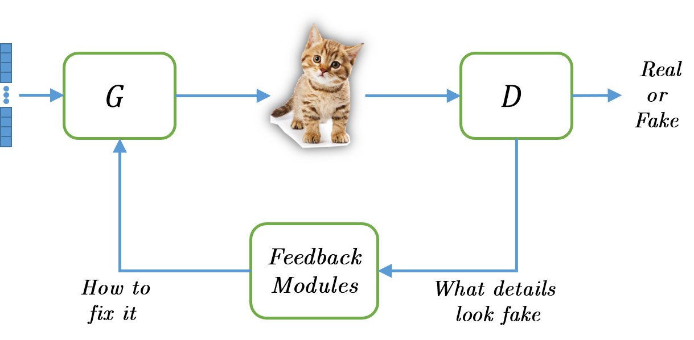
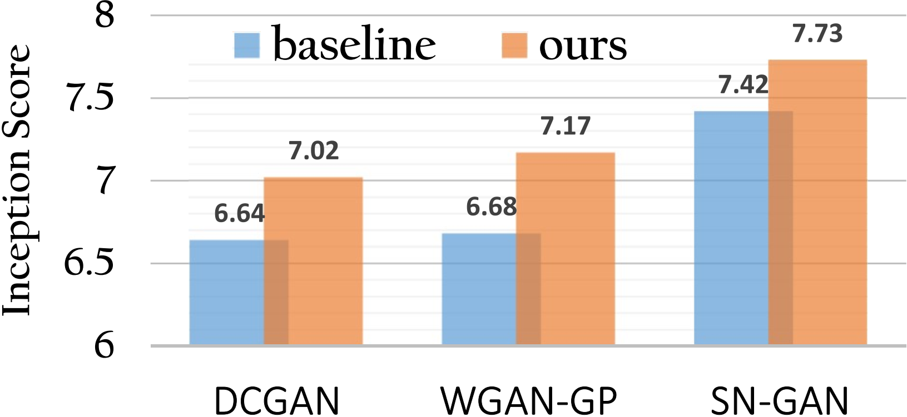
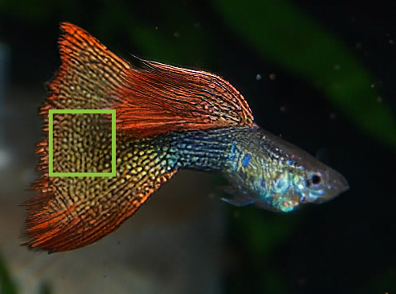
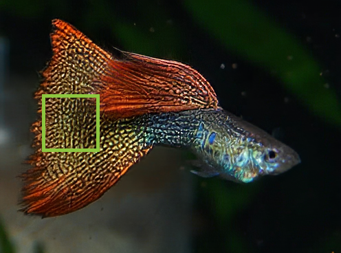
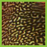
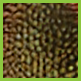
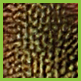
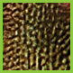
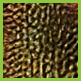

# Adversarial Feedback Loop
[<b>[ArXiv]</b>](https://arxiv.org/pdf/1811.08126)  [<b>[project page]</b>](https://cgm.technion.ac.il/Computer-Graphics-Multimedia/Software/AFL/)

<b>Official repository of Adversarial Feedback Loop paper<br>
Firas Shama, [Roey Mechrez](http://cgm.technion.ac.il/people/Roey/), Alon Shoshan, [Lihi Zelnik-Manor](http://lihi.eew.technion.ac.il/)<br>
[Technion - Israel Institute of Technology](http://cgm.technion.ac.il/)</b>

<div align='center'>
<br>
<b>The Adversarial Feedback Loop</b>
</div>


### Improves quality of GANs (CIFAR10):
<div align='center'>

</div>

### Improves face generation (CelebA):


### Improves super-resolution:


|  |<br>|
|:---:|:---:|
|<b>Baseline</b> | <b>Ours</b>|


|  |  |  |  |  |
| :----------: | :----------: | :----------: | :----------: | :----------: |
| <b>GT</b> | <b>Baseline</b> | <b>iter1</b> | <b>iter2</b> | <b>iter3</b> |


### Code usage
The repository includes the source code used for the paper.
Each application has its own usage guidelines, please follow the instructions in each application directory.
### Citation

If you find our research or code useful for you, please cite our paper:

```
@article{shama2018adversarial,
  title={Adversarial Feedback Loop},
  author={Shama, Firas and Mechrez, Roey and Shoshan, Alon and Zelnik-Manor, Lihi},
  journal={arXiv preprint arXiv:1811.08126},
  year={2018}
}
```

