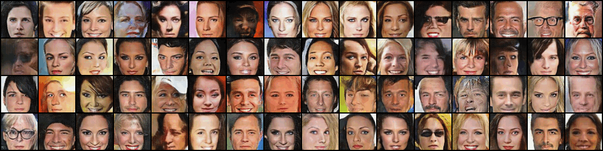
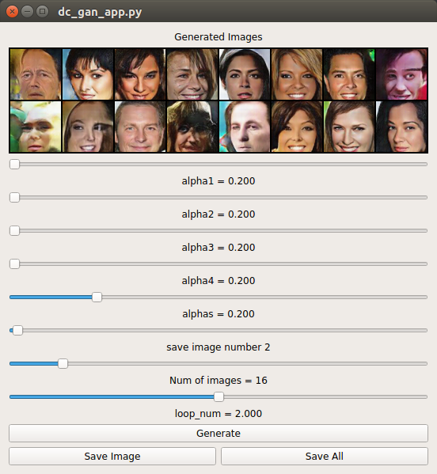

# AFL with DCGAN on CelebA
  

#### Train model
To train the model, first set the dataset path in `host_configurations/paths.py` file. Then run: 
`python train.py --app_name appName --training_scheme all `  
or set the arguments in `config.py` file

#### Test model (Run interactive Demo)
To reproduce paper results, download the [pre pretrained(avaialble soon)]() models  
`python dc_gan_app.py --app_name appName`

  
